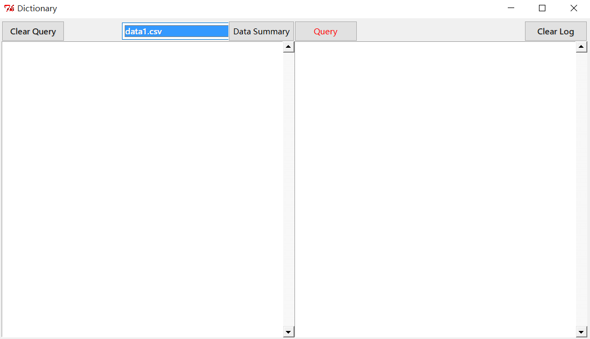

[Dictionary](https://github.com/zxjsdp/bioinfo-scripts/tree/master/Dictionary)
==============================================================================

Dictionary for sequence file.

1. [CSV_Dictionary](https://github.com/zxjsdp/bioinfo-scripts/tree/master/Dictionary/CSV_Dictionary)

    Dictionary for query multiple lines in CSV file.

    

    Usage:

    - Windows, Linux, and Mac OS:

        Run this command in terminal or command line

            python csv_dict.py

    - Windows users can also do this if you don't like command prompt:

        1. Delete first line in csv_dict.py
        2. Change the extension from .py to .pyw
        
        Then double click csv_dict.pyw to run it.

