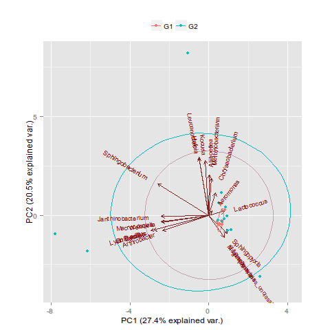

Principal component analysis
============================

This folder contains scripts for easily do PCA and draw PCA plots.

PCA and PCA plot is done by R, but we use Python to run R here,
so that you don't need to handle R commands, and you can do multiple
PCA automatically.

1. [Randomly_select_and_do_multiple_PCAs](https://github.com/zxjsdp/bioinfo-scripts/tree/master/PCA/Randomly_select_and_do_multiple_PCAs)

    By using scripts in this folder, you can select data lines randomly and
    do multiple PCAs (default is 100 times), then draw multiple PCA plots (PDF & PNG)
    automatically.

    Example run (Data is already prepared, just run these command is OK):

        $ python random_sample.py
        $ python run_r.py

    Command explaination:

    1. `python random_sample.py`

        Select lines randomly from source matrix and generate files.

        **PREPARATION:**

        You need two files:

        **data.csv:**

        data.csv is csv file that contains the data matrix.
        WARNING: only data, not any header.

                                   group_1               group_2         ...
                                     |                      |
                                +----+-----+            +---+---+
                                |          |            |       |
                              id_1        id_2        id_3    id_4       ...
                          +----------+-----------+-----------+----------
             component_1  |    2     |     8     |     7     |  ...
             component_1  |    5     |     7     |     9     |  ...
             component_1  |    0     |     0     |     8     |  ...
             component_1  |    8     |     1     |     0     |  ...
             component_1  |    1     |     2     |     0     |  ...
             ...          |   ...    |    ...    |    ...    |  ...

        **header.txt:**

        header.txt is text file that has each component as one line.

        #### AFTER RUNNING

        After running, there will be a new folder named "sample" generated for you.
        All sample csv files can be found there.

        And a "random_list_log.txt" file will be generated for you. This file is
        important for you because if you find any interesting thing if the PDF or PNG
        files, you need to check this log file to see what it was.

            ./
             |__ sample/
             |   |__ 0.csv
             |   |__ 1.csv
             |   |__ 2.csv
             |   |__ 3.csv
             |   |__ ...
             |
             |__ random_list_log.txt

    2. `python run_r.py`

        Run multiple R script automatically and do PCA, genarating PDF files.

        **PREPARATION:**

        You need to install R for PCA analysis. And two additional packages required:

            # You need to install R and install the following packages in R

            # devtools
            install.packages('devtools')

            # ggbiplot
            library(devtools)
            install_github("vqv/ggbiplot")

        **BEFORE RUNNING**

            ./
             |__ run_r.py
             |
             |__ sample/
             |   |__ 0.csv
             |   |__ 1.csv
             |   |__ 2.csv
             |   |__ ...
             |
             |__ template.r

        **AFTER RUNNING:**

            ./
             |
             |__ R_Scripts/
             |   |__ 0.r
             |   |__ 1.r
             |   |__ 2.r
             |   |__ ...
             |
             |__ PDF/
             |   |__ 0.pdf
             |   |__ 1.pdf
             |   |__ 2.pdf
             |   |__ ...
             |
             |__ PNG/
             |   |__ 0.png
             |   |__ 1.png
             |   |__ 2.png
             |   |__ ...
             |
             |__ log.txt

        What you need is in PDF & PNG folders.

        Two outcome PNG demo (2/100):

        
        

        References:

        - [vqv/ggbiplot @ GitHub](https://github.com/vqv/ggbiplot)
        - [Computing and visualizing PCA in R](http://www.r-bloggers.com/computing-and-visualizing-pca-in-r/)

